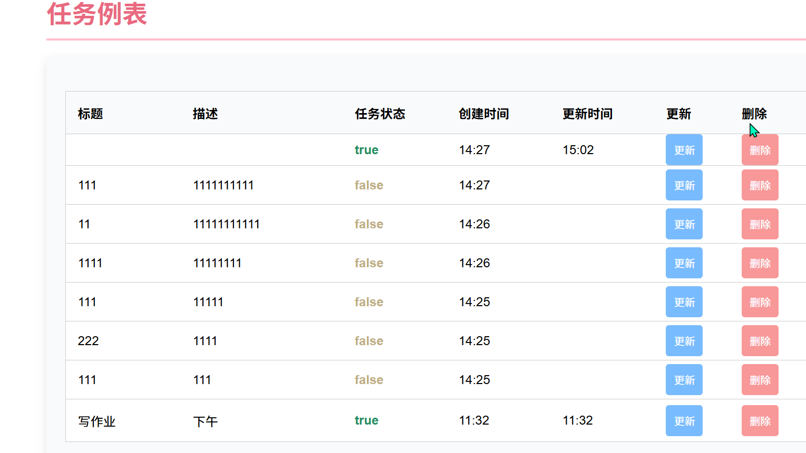
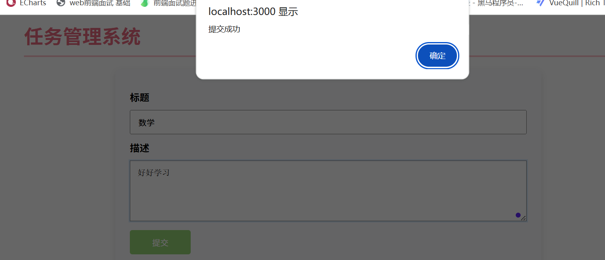
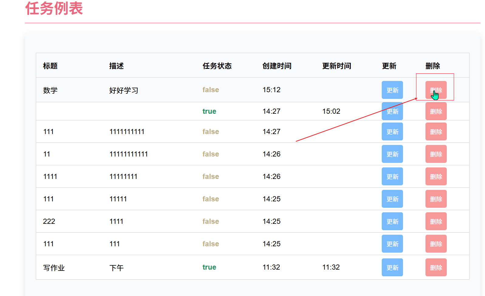
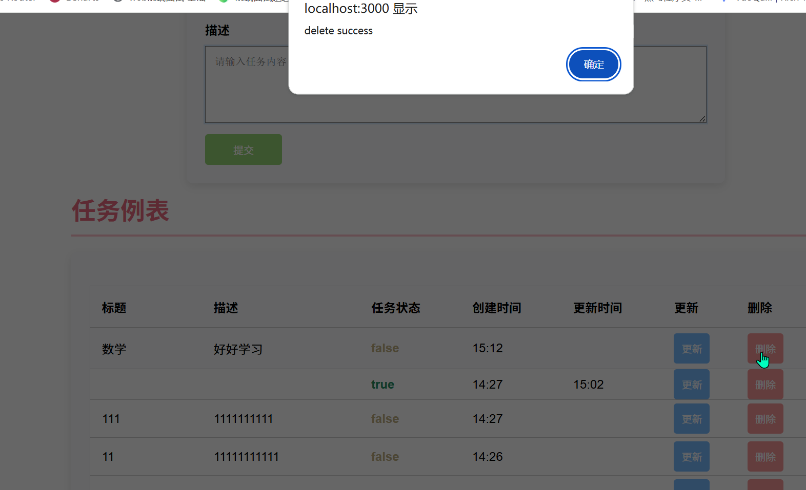
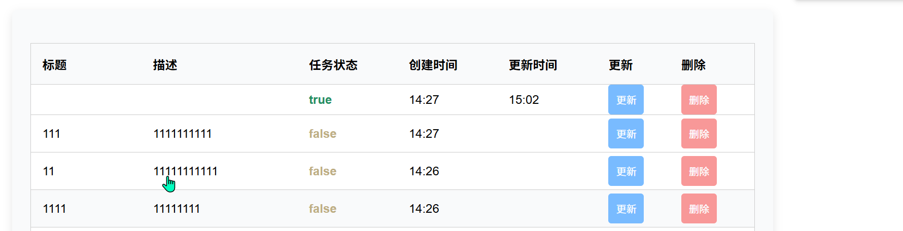
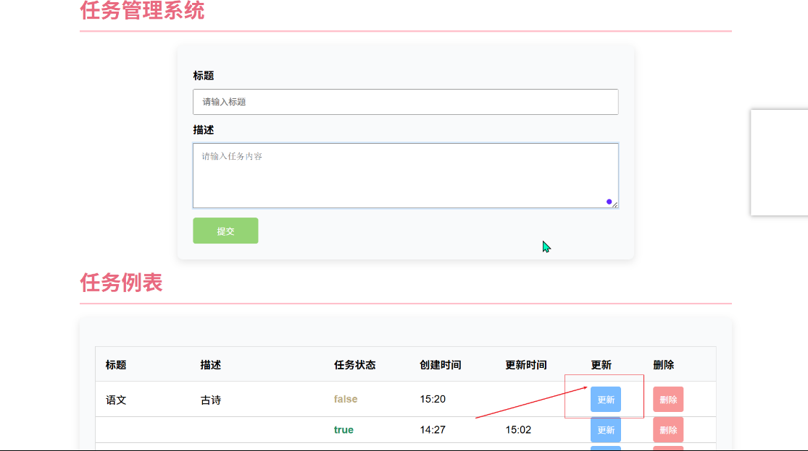
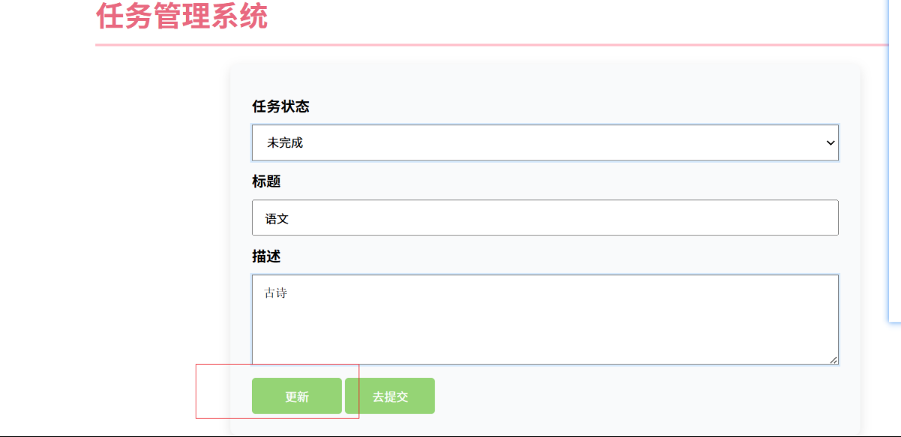
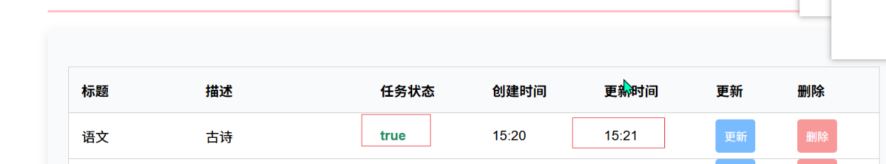

# 功能演示截图  
## 1. 获取任务列表（GET）  
接口：`GET http://localhost:3000/api/todos`  
操作：直接发送 GET 请求,  
截图：  
    
  *说明：首次运行可能为空，创建任务后会有内容*


## 2. 创建任务（POST）  
接口：`POST http://localhost:3000/api/todos`  
请求体（JSON）：  
```json
  {
    "title": "买 groceries",
    "description"(可选): "去超市买牛奶、面包",
   
  }
```
操作：发送 POST 请求, 并在请求体中包含 JSON 数据
截图：  
  
  *说明：返回 JSON 数据包含创建的任务信息*
## 3. 删除任务（DELETE）
接口：`DELETE http://localhost:3000/api/todos/id`
操作：发送 DELETE 请求, 并在 URL 中包含要删除的任务 ID
截图：
  
  
  
  *说明：返回 JSON 数据包含删除的任务信息
## 4. 更新任务（PUT）
接口：`PUT http://localhost:3000/api/todos/id`
请求体（JSON）：
```json
  {
    "title": "买 groceries",
    "description"(可选): "去超市买牛奶、面包",
    "completed"(可选): true
  }
```
操作：发送 PUT 请求, 并在 URL 中包含要更新的任务 ID, 并在请求体中包含 JSON 数据
截图：
  
  
  
  说明先点击更新按钮，传id 和内容到7.png 在7.png 可以改状态，内容，标题，在提交 ，后8.png 显示更改的内容，时间，状态
